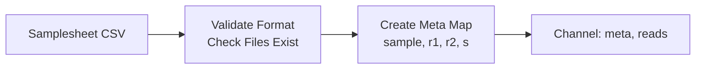
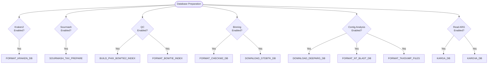
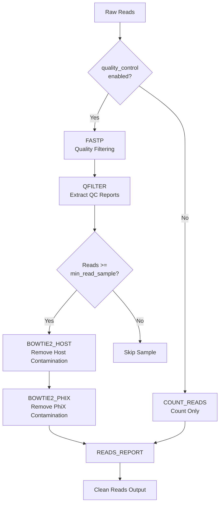
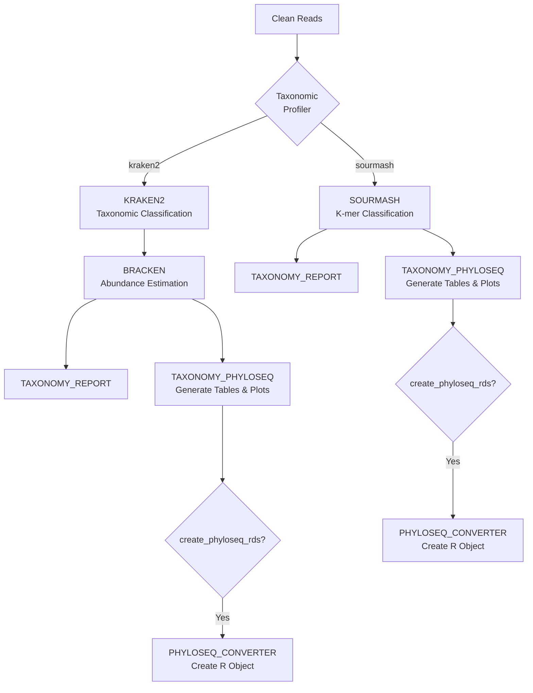
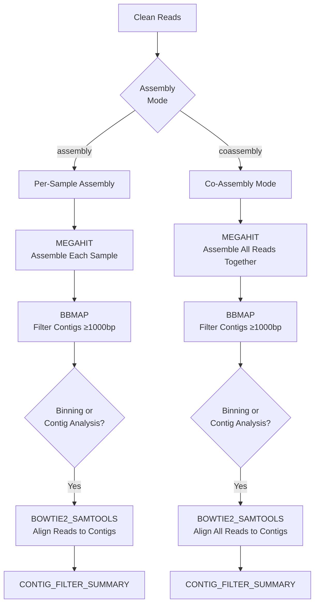
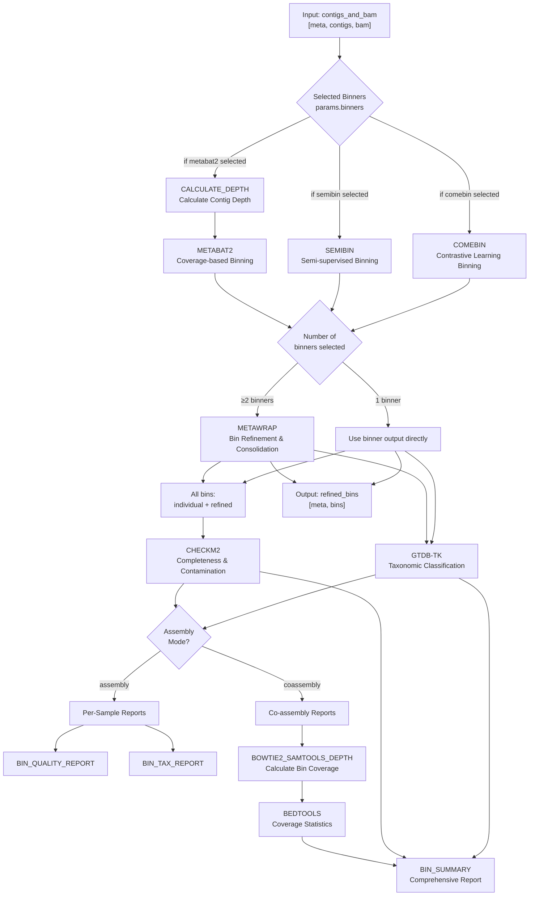
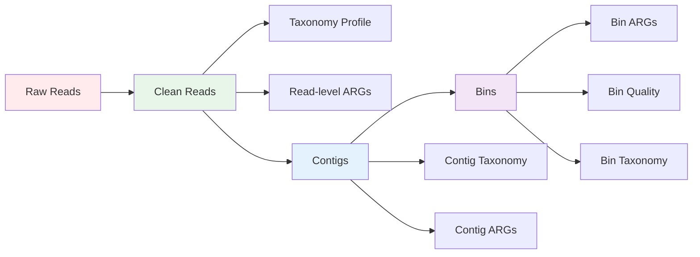

# BugBuster Pipeline Workflow Diagram

## Overview
BugBuster is a comprehensive metagenomic analysis pipeline for bacterial genome assembly, binning, and antimicrobial resistance gene (ARG) prediction.

---

## Main Workflow Architecture

```mermaid
flowchart TD
    Start([Input Samplesheet CSV]) --> InputCheck[INPUT_CHECK<br/>Validate & Parse Samplesheet]
    
    InputCheck --> PrepDB[PREPARE_DATABASES<br/>Download/Format Databases]
    InputCheck --> QC
    
    %% Quality Control Branch
    QC[QC SUBWORKFLOW<br/>Quality Control & Host Decontamination] --> CleanReads{Clean Reads}
    
    %% Taxonomy Branch
    CleanReads -->|if taxonomic_profiler != none| Taxonomy[TAXONOMY SUBWORKFLOW<br/>Kraken2 or Sourmash]
    
    %% Read-level ARG Branch
    CleanReads -->|if read_arg_prediction| ReadARG[Read-level ARG Prediction<br/>KARGVA → KARGA → ARGS_OAP]
    ReadARG --> ARGNorm[ARG_NORM_REPORT]
    
    %% Assembly Branch
    CleanReads -->|if assembly_mode != none| Assembly[ASSEMBLY SUBWORKFLOW<br/>MEGAHIT Assembly]
    
    Assembly --> Contigs{Contigs & BAM}
    
    %% Binning Branch
    Contigs -->|if include_binning| Binning[BINNING SUBWORKFLOW<br/>Selected binners from:<br/>MetaBAT2, SemiBin, COMEBin]
    Binning --> RefinedBins[Refined Bins<br/>MetaWRAP (if ≥2 binners) + CheckM2 + GTDB-TK]
    
    %% Contig-level Analysis Branch
    Contigs -->|if contig_tax_and_arg| ContigTax[Contig-level Taxonomy & ARG<br/>NT_BLASTN + BLOBTOOLS]
    ContigTax --> ContigARG[PRODIGAL_CONTIGS → DEEPARG_CONTIGS]
    ContigARG --> ARGContigReport[ARG_CONTIG_LEVEL_REPORT]
    ARGContigReport --> ARGBlobplot[ARG_BLOBPLOT]
    
    %% MetaCerberus Branch
    Contigs -->|if assembly_mode==assembly<br/>& contig_level_metacerberus| MetaCerberus[METACERBERUS_CONTIGS<br/>Functional Annotation]
    
    %% Bin ARG Clustering Branch
    RefinedBins -->|if arg_bin_clustering| BinARG[PRODIGAL_BINS → DEEPARG_BINS]
    BinARG --> ARGFormat[ARG_FASTA_FORMATTER]
    ARGFormat --> Clustering[CLUSTERING]
    
    %% MultiQC Reporting
    QC --> MultiQC[MULTIQC<br/>Aggregate QC Reports]
    Taxonomy --> MultiQC
    
    %% End
    MultiQC --> End([Results Output])
    ARGNorm --> End
    ARGBlobplot --> End
    Clustering --> End
    MetaCerberus --> End
    RefinedBins --> End

    %% Styling
    classDef subworkflow fill:#e1f5ff,stroke:#0288d1,stroke-width:3px
    classDef module fill:#fff3e0,stroke:#f57c00,stroke-width:2px
    classDef decision fill:#f3e5f5,stroke:#7b1fa2,stroke-width:2px
    classDef database fill:#e8f5e9,stroke:#388e3c,stroke-width:2px
    
    class InputCheck,QC,Taxonomy,Assembly,Binning subworkflow
    class ReadARG,ContigTax,ContigARG,BinARG,MetaCerberus,MultiQC module
    class CleanReads,Contigs decision
    class PrepDB database
```

---

## Detailed Subworkflow Breakdowns

### 1. INPUT_CHECK Subworkflow


**Outputs:**
- `reads`: Channel of `[meta, [r1, r2, s?]]` tuples

---

### 2. PREPARE_DATABASES Subworkflow


**Outputs:**
- `kraken_db`, `sourmash_db`, `phix_index`, `host_index`, `checkm2_db`, `gtdbtk_db`, `deeparg_db`, `blast_db`, `taxdump`, `karga_db`, `kargva_db`

---

### 3. QC Subworkflow


**Outputs:**
- `reads`: Clean reads `[meta, reads]`
- `reads_coassembly`: Collected reads for coassembly
- `report`: QC summary report
- `fastp_json`: FASTP JSON for MultiQC

---

### 4. TAXONOMY Subworkflow


**Outputs:**
- Taxonomy reports, phyloseq tables, abundance plots

---

### 5. ASSEMBLY Subworkflow


**Outputs:**
- `contigs`: `[meta, reads, contigs]` for binning
- `contigs_meta`: `[meta, contigs]` for annotation
- `bam`: `[meta, contigs, bam]` for depth analysis
- `bam_meta`: `[meta, bam]` for indexing

---

### 6. BINNING Subworkflow (Unified - Mode-Agnostic)


**Key Features:**
- **Unified workflow**: Single implementation handles both assembly and co-assembly modes
- **Selectable binners**: Run any combination of MetaBAT2, SemiBin, and COMEBin via `--binners`
- **Conditional MetaWRAP**: Bin refinement only runs when ≥2 binners are selected
- **Single-binner mode**: When only one binner is selected, its output is used directly (no MetaWRAP overhead)
- **Mode-specific reporting**:
  - Assembly mode: Simple quality and taxonomy reports
  - Co-assembly mode: Additional bin coverage analysis and comprehensive summary

**Inputs:**
- `contigs_and_bam`: `[meta, contigs, bam]` - Contigs with aligned reads
- `checkm2_db`: CheckM2 database path
- `gtdbtk_db`: GTDB-Tk database path
- `reads`: `[meta, reads]` - Original reads (for co-assembly bin coverage only)

**Outputs:**
- `refined_bins`: `[meta, bins]` - High-quality refined bins with quality and taxonomy annotations
- `versions`: Tool version information

---

## Pipeline Parameters & Conditional Execution

### Key Parameters

| Parameter | Default | Description |
|-----------|---------|-------------|
| `quality_control` | `true` | Enable QC and host filtering |
| `assembly_mode` | `'assembly'` | Assembly mode: 'assembly', 'coassembly', 'none' |
| `taxonomic_profiler` | `'kraken2'` | Profiler: 'kraken2', 'sourmash', 'none' |
| `include_binning` | `false` | Enable binning and refinement |
| `binners` | `'semibin'` | Comma-separated binners: 'comebin', 'semibin', 'metabat2'. ≥2 enables MetaWRAP |
| `read_arg_prediction` | `false` | Enable read-level ARG prediction |
| `contig_tax_and_arg` | `false` | Enable contig-level taxonomy and ARG |
| `contig_level_metacerberus` | `false` | Enable MetaCerberus annotation |
| `arg_bin_clustering` | `false` | Enable ARG clustering in bins |

---

## Data Flow Summary



---

## Module Categories

### Core Analysis Modules
- **Quality Control**: FASTP, QFILTER, BOWTIE2 (host/PhiX removal)
- **Taxonomy**: KRAKEN2, BRACKEN, SOURMASH
- **Assembly**: MEGAHIT, BBMAP
- **Binning**: METABAT2, SEMIBIN, COMEBIN, METAWRAP
- **Quality Assessment**: CHECKM2, GTDB-TK

### ARG Prediction Modules
- **Read-level**: KARGVA, KARGA, ARGS_OAP
- **Contig-level**: DEEPARG_CONTIGS
- **Bin-level**: DEEPARG_BINS

### Annotation & Reporting Modules
- **Functional**: METACERBERUS, PRODIGAL
- **Taxonomy**: NT_BLASTN, BLOBTOOLS
- **Reporting**: MultiQC, custom report generators

---

## Output Structure

```
results/
├── qc/                          # Quality control reports
├── taxonomy/                    # Taxonomic profiles
├── assembly/                    # Assembled contigs
├── binning/                     # Refined bins
│   ├── metabat2/
│   ├── semibin/
│   ├── comebin/
│   ├── metawrap/
│   ├── checkm2/
│   └── gtdbtk/
├── arg_prediction/              # ARG analysis results
│   ├── reads/
│   ├── contigs/
│   └── bins/
├── annotation/                  # Functional annotations
└── multiqc/                     # Aggregated QC report
```

---

## Execution Modes

### Mode 1: Full Pipeline (Default)
- QC → Taxonomy → Assembly → Binning → ARG Prediction → Annotation

### Mode 2: QC + Taxonomy Only
```bash
--assembly_mode none --read_arg_prediction false
```

### Mode 3: Assembly + Binning Only
```bash
--taxonomic_profiler none --read_arg_prediction false
```

### Mode 5: Binning with Single Fast Binner (Default)
```bash
--include_binning true --binners semibin
```

### Mode 6: Binning with MetaWRAP Refinement (Multiple Binners)
```bash
--include_binning true --binners semibin,metabat2
# or all three:
--include_binning true --binners semibin,metabat2,comebin
```

### Mode 4: Co-assembly Mode
```bash
--assembly_mode coassembly
```

---

**Pipeline Version**: As defined in `nextflow.config`  
**Last Updated**: Based on current codebase analysis
