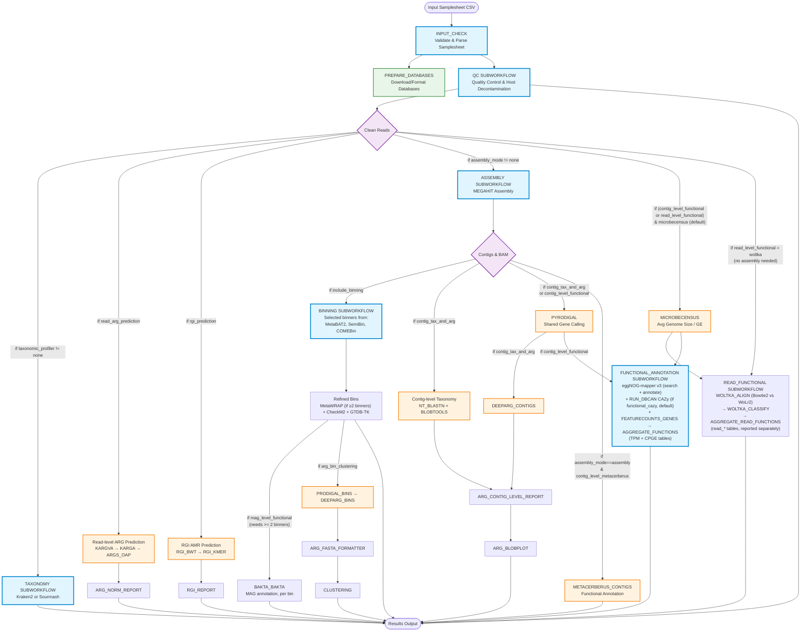
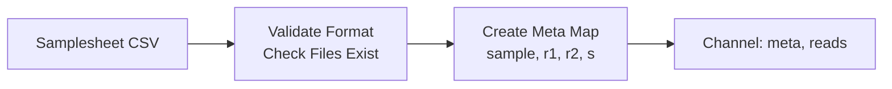
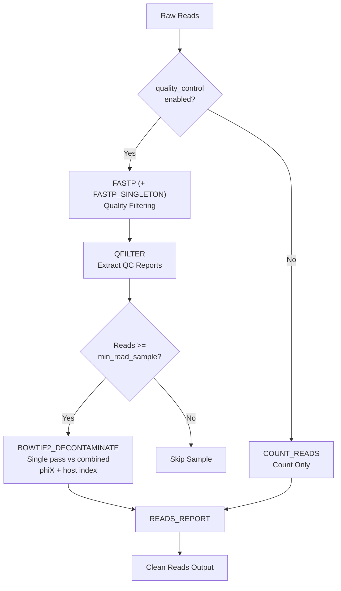
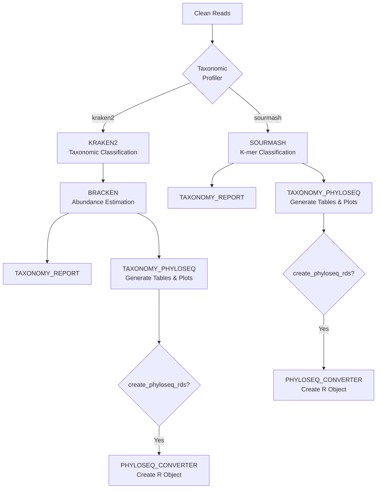
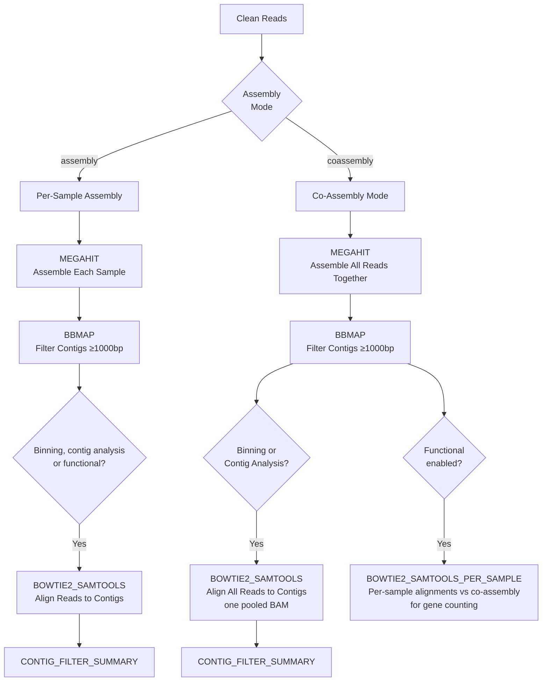
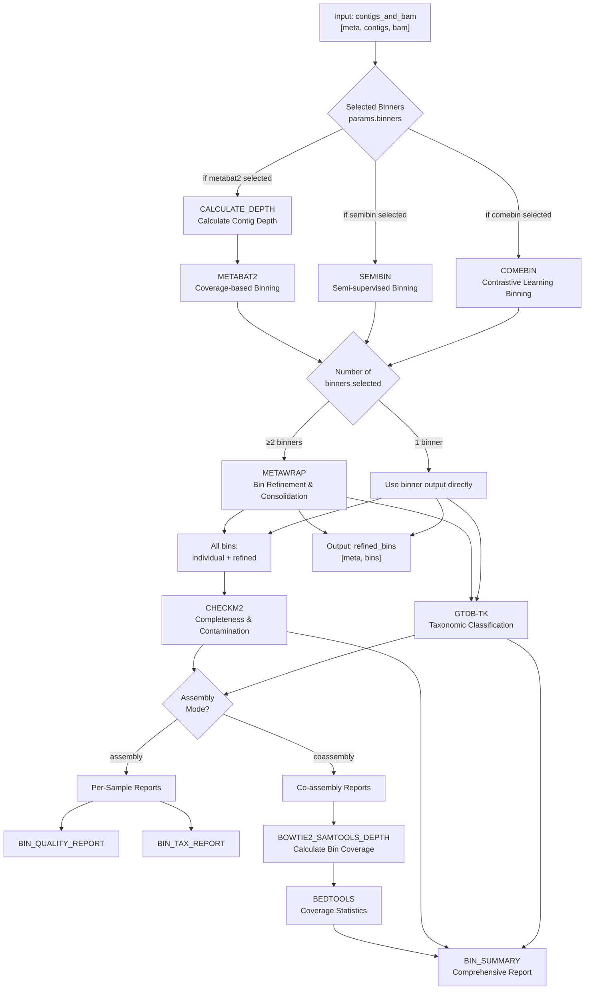
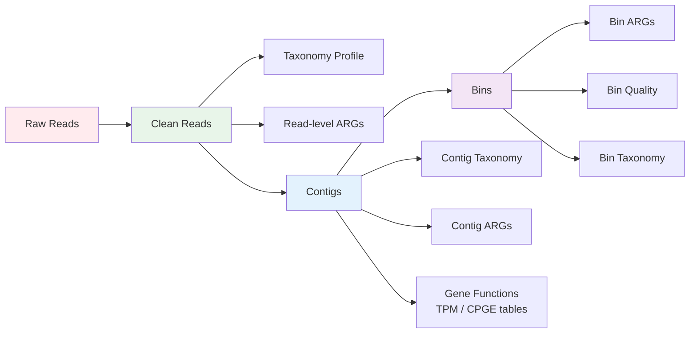

# BugBuster Pipeline Workflow Diagram

## Overview
BugBuster is a comprehensive metagenomic analysis pipeline for bacterial genome assembly, binning, and antimicrobial resistance gene (ARG) prediction.

---

## Main Workflow Architecture


```mermaid
flowchart TD
    Start([Input Samplesheet CSV]) --> InputCheck[INPUT_CHECK<br/>Validate & Parse Samplesheet]
    
    InputCheck --> PrepDB[PREPARE_DATABASES<br/>Download/Format Databases]
    InputCheck --> QC
    
    %% Quality Control Branch
    QC[QC SUBWORKFLOW<br/>Quality Control & Host Decontamination] --> CleanReads{Clean Reads}
    
    %% Taxonomy Branch
    CleanReads -->|if taxonomic_profiler != none| Taxonomy[TAXONOMY SUBWORKFLOW<br/>Kraken2 or Sourmash]
    
    %% Read-level ARG Branch
    CleanReads -->|if read_arg_prediction| ReadARG[Read-level ARG Prediction<br/>KARGVA → KARGA → ARGS_OAP]
    ReadARG --> ARGNorm[ARG_NORM_REPORT]

    %% RGI Branch
    CleanReads -->|if rgi_prediction| RGI[RGI AMR Prediction<br/>RGI_BWT → RGI_KMER]
    RGI --> RGIReport[RGI_REPORT]
    
    %% Assembly Branch
    CleanReads -->|if assembly_mode != none| Assembly[ASSEMBLY SUBWORKFLOW<br/>MEGAHIT Assembly]
    
    Assembly --> Contigs{Contigs & BAM}
    
    %% Binning Branch
    Contigs -->|if include_binning| Binning[BINNING SUBWORKFLOW<br/>Selected binners from:<br/>MetaBAT2, SemiBin, COMEBin]
    Binning --> RefinedBins["Refined Bins<br/>MetaWRAP (if ≥2 binners) + CheckM2 + GTDB-TK"]
    
    %% Contig-level Analysis Branch
    Contigs -->|if contig_tax_and_arg| ContigTax[Contig-level Taxonomy<br/>NT_BLASTN + BLOBTOOLS]
    Contigs -->|"if contig_tax_and_arg<br/>or contig_level_functional"| Pyrodigal[PYRODIGAL<br/>Shared Gene Calling]
    Pyrodigal -->|if contig_tax_and_arg| ContigARG[DEEPARG_CONTIGS]
    ContigTax --> ARGContigReport
    ContigARG --> ARGContigReport[ARG_CONTIG_LEVEL_REPORT]
    ARGContigReport --> ARGBlobplot[ARG_BLOBPLOT]

    %% Functional Annotation Branch
    CleanReads -->|"if (contig_level_functional or read_level_functional)<br/>& microbecensus (default)"| MicrobeCensus[MICROBECENSUS<br/>Avg Genome Size / GE]
    CleanReads -->|"if read_level_functional = woltka<br/>(no assembly needed)"| ReadFunctional["READ_FUNCTIONAL SUBWORKFLOW<br/>WOLTKA_ALIGN (Bowtie2 vs WoLr2)<br/>→ WOLTKA_CLASSIFY<br/>→ AGGREGATE_READ_FUNCTIONS<br/>(read_* tables, reported separately)"]
    MicrobeCensus --> ReadFunctional
    Pyrodigal -->|if contig_level_functional| Functional["FUNCTIONAL_ANNOTATION SUBWORKFLOW<br/>eggNOG-mapper v3 (search + annotate)<br/>+ RUN_DBCAN CAZy (if functional_cazy, default)<br/>+ FEATURECOUNTS_GENES → AGGREGATE_FUNCTIONS<br/>(TPM + CPGE tables)"]
    MicrobeCensus --> Functional
    RefinedBins -->|"if mag_level_functional<br/>(needs >= 2 binners)"| Bakta[BAKTA_BAKTA<br/>MAG annotation, per bin]

    %% MetaCerberus Branch
    Contigs -->|if assembly_mode==assembly<br/>& contig_level_metacerberus| MetaCerberus[METACERBERUS_CONTIGS<br/>Functional Annotation]
    
    %% Bin ARG Clustering Branch
    RefinedBins -->|if arg_bin_clustering| BinARG[PRODIGAL_BINS → DEEPARG_BINS]
    BinARG --> ARGFormat[ARG_FASTA_FORMATTER]
    ARGFormat --> Clustering[CLUSTERING]
    
    %% End
    QC --> End([Results Output])
    Taxonomy --> End
    ARGNorm --> End
    RGIReport --> End
    ARGBlobplot --> End
    Clustering --> End
    MetaCerberus --> End
    Functional --> End
    ReadFunctional --> End
    Bakta --> End
    RefinedBins --> End

    %% Styling
    classDef subworkflow fill:#e1f5ff,stroke:#0288d1,stroke-width:3px
    classDef module fill:#fff3e0,stroke:#f57c00,stroke-width:2px
    classDef decision fill:#f3e5f5,stroke:#7b1fa2,stroke-width:2px
    classDef database fill:#e8f5e9,stroke:#388e3c,stroke-width:2px
    
    class InputCheck,QC,Taxonomy,Assembly,Binning,Functional subworkflow
    class ReadARG,RGI,ContigTax,ContigARG,BinARG,MetaCerberus,Pyrodigal,MicrobeCensus module
    class CleanReads,Contigs decision
    class PrepDB database
```

---

## Detailed Subworkflow Breakdowns

### 1. INPUT_CHECK Subworkflow

```mermaid
flowchart LR
    CSV[Samplesheet CSV] --> Validate[Validate Format<br/>Check Files Exist]
    Validate --> Meta[Create Meta Map<br/>sample, r1, r2, s]
    Meta --> Reads[Channel: meta, reads]
```

**Outputs:**
- `reads`: Channel of `[meta, [r1, r2, s?]]` tuples

---

### 2. PREPARE_DATABASES Subworkflow

```mermaid
flowchart TD
    Start([Database Preparation]) --> Kraken{Kraken2<br/>Enabled?}
    Start --> Sourmash{Sourmash<br/>Enabled?}
    Start --> QCdb{QC<br/>Enabled?}
    Start --> Bindb{Binning<br/>Enabled?}
    Start --> Contigdb{Contig Analysis<br/>Enabled?}
    Start --> Funcdb{Functional<br/>Enabled?}
    Start --> ReadARGdb{Read ARG<br/>Enabled?}
    Start --> RGIdb{RGI<br/>Enabled?}
    Start --> Magdb{mag_level_functional?}
    Start --> Readfuncdb{"read_level_functional<br/>= woltka?"}
    
    Kraken -->|Yes| KrakenDB[FORMAT_KRAKEN_DB]
    Sourmash -->|Yes| SourmashDB[SOURMASH_TAX_PREPARE]
    QCdb -->|Yes| Decontam[BOWTIE2_BUILD_COMBINED]
    Bindb -->|Yes| CheckM2[FORMAT_CHECKM2_DB]
    Bindb -->|Yes| GTDBTK[DOWNLOAD_GTDBTK_DB]
    Contigdb -->|Yes| DeepARG[DOWNLOAD_DEEPARG_DB]
    Contigdb -->|Yes| BLAST[FORMAT_NT_BLAST_DB]
    Contigdb -->|Yes| Taxdump[FORMAT_TAXDUMP_FILES]
    Funcdb -->|Yes| EggnogDB[FORMAT_EGGNOG_DB]
    Funcdb -->|Yes| CogDB[FORMAT_COG_DB]
    Funcdb -->|"Yes (+ functional_cazy)"| DbcanDB[FORMAT_DBCAN_DB]
    Magdb -->|Yes| BaktaDB[FORMAT_BAKTA_DB]
    Readfuncdb -->|Yes| WoltkaDB[FORMAT_WOLTKA_DB]
    ReadARGdb -->|Yes| KARGA[KARGA_DB]
    ReadARGdb -->|Yes| KARGVA[KARGVA_DB]
    RGIdb -->|Yes| RGILoad[RGI_LOAD /<br/>RGI_LOAD_WILDCARD]
```

**Outputs:**
- `kraken_db`, `sourmash_db`, `decontamination_index`, `checkm2_db`, `gtdbtk_db`, `deeparg_db`, `blast_db`, `taxdump`, `eggnog_db`, `dbcan_db`, `cog_def`, `bakta_db`, `woltka_db`, `karga_db`, `kargva_db`, `rgi_card_db`

---

### 3. QC Subworkflow

```mermaid
flowchart TD
    Reads[Raw Reads] --> QCCheck{quality_control<br/>enabled?}
    
    QCCheck -->|Yes| FASTP["FASTP (+ FASTP_SINGLETON)<br/>Quality Filtering"]
    FASTP --> QFILTER[QFILTER<br/>Extract QC Reports]
    QFILTER --> MinReads{Reads >=<br/>min_read_sample?}
    MinReads -->|Yes| Decontaminate[BOWTIE2_DECONTAMINATE<br/>Single pass vs combined<br/>phiX + host index]
    MinReads -->|No| Skip1[Skip Sample]
    Decontaminate --> ReadsReport[READS_REPORT]
    
    QCCheck -->|No| CountReads[COUNT_READS<br/>Count Only]
    CountReads --> ReadsReport
    
    ReadsReport --> CleanReads[Clean Reads Output]
```

**Outputs:**
- `reads`: Clean reads `[meta, reads]`
- `report`: QC summary report

---

### 4. TAXONOMY Subworkflow

```mermaid
flowchart TD
    Reads[Clean Reads] --> Profiler{Taxonomic<br/>Profiler}
    
    Profiler -->|kraken2| Kraken2[KRAKEN2<br/>Taxonomic Classification]
    Kraken2 --> Bracken[BRACKEN<br/>Abundance Estimation]
    Bracken --> TaxReport1[TAXONOMY_REPORT]
    Bracken --> TaxPhylo1[TAXONOMY_PHYLOSEQ<br/>Generate Tables & Plots]
    TaxPhylo1 --> PhyloOpt1{create_phyloseq_rds?}
    PhyloOpt1 -->|Yes| PhyloConv1[PHYLOSEQ_CONVERTER<br/>Create R Object]
    
    Profiler -->|sourmash| Sourmash[SOURMASH<br/>K-mer Classification]
    Sourmash --> TaxReport2[TAXONOMY_REPORT]
    Sourmash --> TaxPhylo2[TAXONOMY_PHYLOSEQ<br/>Generate Tables & Plots]
    TaxPhylo2 --> PhyloOpt2{create_phyloseq_rds?}
    PhyloOpt2 -->|Yes| PhyloConv2[PHYLOSEQ_CONVERTER<br/>Create R Object]
```

**Outputs:**
- Taxonomy reports, phyloseq tables, abundance plots

---

### 5. ASSEMBLY Subworkflow

```mermaid
flowchart TD
    Reads[Clean Reads] --> Mode{Assembly<br/>Mode}
    
    Mode -->|assembly| PerSample[Per-Sample Assembly]
    PerSample --> MEGAHIT1[MEGAHIT<br/>Assemble Each Sample]
    MEGAHIT1 --> BBMAP1[BBMAP<br/>Filter Contigs ≥1000bp]
    BBMAP1 --> Align1{Binning, contig analysis<br/>or functional?}
    Align1 -->|Yes| Bowtie1[BOWTIE2_SAMTOOLS<br/>Align Reads to Contigs]
    Bowtie1 --> Summary1[CONTIG_FILTER_SUMMARY]
    
    Mode -->|coassembly| CoAssembly[Co-Assembly Mode]
    CoAssembly --> MEGAHIT2[MEGAHIT<br/>Assemble All Reads Together]
    MEGAHIT2 --> BBMAP2[BBMAP<br/>Filter Contigs ≥1000bp]
    BBMAP2 --> Align2{Binning or<br/>Contig Analysis?}
    Align2 -->|Yes| Bowtie2[BOWTIE2_SAMTOOLS<br/>Align All Reads to Contigs<br/>one pooled BAM]
    BBMAP2 --> AlignFunc{Functional<br/>enabled?}
    AlignFunc -->|Yes| BowtiePS[BOWTIE2_SAMTOOLS_PER_SAMPLE<br/>Per-sample alignments vs co-assembly<br/>for gene counting]
    Bowtie2 --> Summary2[CONTIG_FILTER_SUMMARY]
```

**Outputs:**
- `contigs`: `[meta, reads, contigs]` for binning
- `contigs_meta`: `[meta, contigs]` for annotation
- `bam`: `[meta, contigs, bam]` for depth analysis
- `bam_meta`: `[meta, bam]` for indexing
- `counting_bam`: `[meta, bam]` per sample in both modes, for featureCounts gene
  quantification (the pooled co-assembly BAM has no read groups, so the
  functional branch gets dedicated per-sample alignments under co-assembly)

---

### 6. BINNING Subworkflow (Unified - Mode-Agnostic)

```mermaid
flowchart TD
    Input["Input: contigs_and_bam<br/>[meta, contigs, bam]"] --> BinnerSelect{Selected Binners<br/>params.binners}

    BinnerSelect -->|if metabat2 selected| CalcDepth[CALCULATE_DEPTH<br/>Calculate Contig Depth]
    CalcDepth --> MetaBAT[METABAT2<br/>Coverage-based Binning]

    BinnerSelect -->|if semibin selected| SemiBin[SEMIBIN<br/>Semi-supervised Binning]
    BinnerSelect -->|if comebin selected| COMEBin[COMEBIN<br/>Contrastive Learning Binning]

    %% Conditional MetaWRAP
    MetaBAT --> BinCount{Number of<br/>binners selected}
    SemiBin --> BinCount
    COMEBin --> BinCount

    BinCount -->|≥2 binners| MetaWRAP[METAWRAP<br/>Bin Refinement & Consolidation]
    BinCount -->|1 binner| DirectOut[Use binner output directly]

    %% Quality and Taxonomy
    MetaWRAP --> AllBins[All bins:<br/>individual + refined]
    DirectOut --> AllBins
    AllBins --> CheckM[CHECKM2<br/>Completeness & Contamination]
    MetaWRAP --> GTDBTK[GTDB-TK<br/>Taxonomic Classification]
    DirectOut --> GTDBTK

    %% Mode-specific reporting
    CheckM --> ModeCheck{Assembly<br/>Mode?}
    GTDBTK --> ModeCheck

    ModeCheck -->|assembly| AssemblyReports[Per-Sample Reports]
    AssemblyReports --> QualReport[BIN_QUALITY_REPORT]
    AssemblyReports --> TaxReport[BIN_TAX_REPORT]

    ModeCheck -->|coassembly| CoassemblyReports[Co-assembly Reports]
    CoassemblyReports --> BinCov[BOWTIE2_SAMTOOLS_DEPTH<br/>Calculate Bin Coverage]
    BinCov --> Bedtools[BEDTOOLS<br/>Coverage Statistics]
    Bedtools --> Summary[BIN_SUMMARY<br/>Comprehensive Report]
    CheckM --> Summary
    GTDBTK --> Summary

    %% Output
    MetaWRAP --> Output["Output: refined_bins<br/>[meta, bins]"]
    DirectOut --> Output
```

**Key Features:**
- **Unified workflow**: Single implementation handles both assembly and co-assembly modes
- **Selectable binners**: Run any combination of MetaBAT2, SemiBin, and COMEBin via `--binners`
- **Conditional MetaWRAP**: Bin refinement only runs when ≥2 binners are selected
- **Single-binner mode**: When only one binner is selected, its output is used directly (no MetaWRAP overhead)
- **Mode-specific reporting**:
  - Assembly mode: Simple quality and taxonomy reports
  - Co-assembly mode: Additional bin coverage analysis and comprehensive summary

**Inputs:**
- `contigs_and_bam`: `[meta, contigs, bam]` - Contigs with aligned reads
- `checkm2_db`: CheckM2 database path
- `gtdbtk_db`: GTDB-Tk database path
- `reads`: `[meta, reads]` - Original reads (for co-assembly bin coverage only)

**Outputs:**
- `refined_bins`: `[meta, bins]` - High-quality refined bins with quality and taxonomy annotations
- `versions`: Tool version information

---

## Pipeline Parameters & Conditional Execution

### Key Parameters

| Parameter | Default | Description |
|-----------|---------|-------------|
| `quality_control` | `true` | Enable QC and host filtering |
| `assembly_mode` | `'assembly'` | Assembly mode: 'assembly', 'coassembly', 'none' |
| `taxonomic_profiler` | `'kraken2'` | Profiler: 'kraken2', 'sourmash', 'none' |
| `include_binning` | `false` | Enable binning and refinement |
| `binners` | `'semibin'` | Comma-separated binners: 'comebin', 'semibin', 'metabat2'. ≥2 enables MetaWRAP |
| `read_arg_prediction` | `false` | Enable read-level ARG prediction (KARGA/KARGVA/ARGs-OAP) |
| `rgi_prediction` | `false` | Enable RGI AMR prediction with pathogen-of-origin |
| `contig_tax_and_arg` | `false` | Enable contig-level taxonomy and ARG |
| `contig_level_functional` | `false` | Enable the contig functional annotation branch (Pyrodigal + eggNOG-mapper v3 + run_dbcan CAZy + featureCounts + TPM/CPGE tables; needs singularity/apptainer) |
| `functional_cazy` | `true` | run_dbcan CAZy annotation within the functional branch |
| `dbcan_consensus` | `'recommended'` | Which dbCAN calls feed aggregation: 'recommended' (≥2 tools) or 'any' |
| `microbecensus` | `true` | MicrobeCensus average genome size for CPGE normalization (non-fatal on failure) |
| `read_level_functional` | `'none'` | Read-level functional profiling backend: 'woltka', 'none' (no assembly needed) |
| `woltka_uniq` | `false` | Woltka: leave multi-hit reads unassigned instead of dividing them 1/k |
| `featurecounts_multimap` | `'primary'` | featureCounts multi-mapping policy: 'primary', 'all', 'none' |
| `contig_level_metacerberus` | `false` | Enable MetaCerberus annotation |
| `arg_bin_clustering` | `false` | Enable ARG clustering in bins |

---

## Data Flow Summary


```mermaid
flowchart LR
    A[Raw Reads] --> B[Clean Reads]
    B --> C[Taxonomy Profile]
    B --> D[Read-level ARGs]
    B --> E[Contigs]
    E --> F[Bins]
    E --> G[Contig Taxonomy]
    E --> H[Contig ARGs]
    E --> L[Gene Functions<br/>TPM / CPGE tables]
    F --> I[Bin ARGs]
    F --> J[Bin Quality]
    F --> K[Bin Taxonomy]
    
    style A fill:#ffebee
    style B fill:#e8f5e9
    style E fill:#e3f2fd
    style F fill:#f3e5f5
```

---

## Module Categories

### Core Analysis Modules
- **Quality Control**: FASTP, FASTP_SINGLETON, QFILTER, BOWTIE2_DECONTAMINATE (combined phiX + host removal), COUNT_READS
- **Taxonomy**: KRAKEN2, BRACKEN, SOURMASH
- **Assembly**: MEGAHIT, BBMAP
- **Binning**: METABAT2, SEMIBIN, COMEBIN, METAWRAP
- **Quality Assessment**: CHECKM2, GTDB-TK

### ARG Prediction Modules
- **Read-level**: KARGVA, KARGA, ARGS_OAP, RGI_BWT, RGI_KMER, RGI_REPORT
- **Contig-level**: DEEPARG_CONTIGS
- **Bin-level**: DEEPARG_BINS

### Annotation & Reporting Modules
- **Functional**: PYRODIGAL (shared gene calling), EGGNOG_MAPPER_SEARCH / EGGNOG_MAPPER_ANNOTATE, RUN_DBCAN, FEATURECOUNTS_GENES, MICROBECENSUS, AGGREGATE_FUNCTIONS, BAKTA_BAKTA (MAG level, per bin), WOLTKA_ALIGN / WOLTKA_CLASSIFY / AGGREGATE_READ_FUNCTIONS (read level), METACERBERUS
- **Taxonomy**: NT_BLASTN, BLOBTOOLS
- **Reporting**: custom report generators

---

## Module Reference

### Subworkflows
| Subworkflow | Description |
|-------------|-------------|
| `INPUT_CHECK` | Validate samplesheet format and file existence |
| `PREPARE_DATABASES` | Download and format all required databases |
| `QC` | Quality control and phiX/host decontamination |
| `TAXONOMY` | Taxonomic profiling with Kraken2 or Sourmash |
| `ASSEMBLY` | Metagenome assembly (per-sample or co-assembly) |
| `BINNING` | Unified binning workflow (mode-agnostic) |
| `FUNCTIONAL_ANNOTATION` | Functional annotation, two independent branches: contig (eggNOG-mapper v3, run_dbcan CAZy, featureCounts gene abundance, study-level TPM/CPGE aggregation) and MAG (Bakta per refined bin) |
| `READ_FUNCTIONAL` | Optional read-level functional profiling, one backend per run (Woltka vs WoLr2); independent of assembly, tables reported separately |

### Quality Control (QC Subworkflow)
| Module | Description |
|--------|-------------|
| `FASTP` / `FASTP_SINGLETON` | Read quality filtering and adapter trimming (paired + singleton reads) |
| `QFILTER` | Extract QC reports and filter by read count |
| `BOWTIE2_DECONTAMINATE` | Single-pass removal of phiX and host reads against the combined index |
| `COUNT_READS` | Read counting when `--quality_control false` |
| `READS_REPORT` | Generate read count summary report |

### Taxonomic Profiling
| Module | Description |
|--------|-------------|
| `KRAKEN2` | K-mer based taxonomic classification |
| `BRACKEN` | Abundance estimation from Kraken2 |
| `SOURMASH` | MinHash-based taxonomic profiling |
| `TAXONOMY_PHYLOSEQ` / `PHYLOSEQ_CONVERTER` | Phyloseq-style tables and optional R object |

### Assembly
| Module | Description |
|--------|-------------|
| `MEGAHIT` | De novo metagenome assembly |
| `BBMAP` | Contig length filtering |
| `BOWTIE2_SAMTOOLS` | Align reads back to contigs |
| `CONTIG_FILTER_SUMMARY` | Track samples whose contigs were fully filtered |

### Binning (BINNING Subworkflow - Mode-Agnostic)
| Module | Condition | Description |
|--------|-----------|-------------|
| `CALCULATE_DEPTH` | if `metabat2` selected | Calculate contig depth from BAM files |
| `METABAT2` | if `metabat2` in `--binners` | Binning by coverage and composition |
| `SEMIBIN` | if `semibin` in `--binners` | Semi-supervised binning |
| `COMEBIN` | if `comebin` in `--binners` | Contrastive learning binning |
| `METAWRAP` | if ≥2 binners selected | Bin refinement and consolidation |
| `CHECKM2_BATCH` | always | Bin completeness and contamination |
| `GTDB_TK_BATCH` | always | Bin taxonomic classification |
| `BIN_QUALITY_REPORT` / `BIN_TAX_REPORT` | assembly mode | Per-sample quality/taxonomy reports |
| `BOWTIE2_SAMTOOLS_DEPTH` / `BEDTOOLS` / `BIN_SUMMARY` | co-assembly mode | Bin coverage and comprehensive summary |

### ARG / AMR Prediction
| Module | Description |
|--------|-------------|
| `KARGA` | Read-level ARG detection |
| `KARGVA` | Read-level ARG variant detection |
| `ARGS_OAP` | Read-level ARG detection and normalization factors |
| `ARG_NORM_REPORT` | Normalized read-level ARG summary |
| `RGI_BWT` / `RGI_KMER` / `RGI_REPORT` | CARD-based AMR prediction with pathogen-of-origin |
| `DEEPARG_CONTIGS` / `DEEPARG_BINS` | ARG prediction on contigs / bins |

### Contig Analysis
| Module | Description |
|--------|-------------|
| `NT_BLASTN` | Contig taxonomic assignment via megablast |
| `SAMTOOLS_INDEX` | Index BAM files for BLOBTOOLS |
| `BLOBTOOLS` / `BLOBPLOT` | Contig taxonomy tables and plots |
| `PYRODIGAL` / `PRODIGAL_BINS` | ORF prediction on contigs (shared gene-calling step, feeds DeepARG and functional annotation) / on bins |
| `ARG_CONTIG_LEVEL_REPORT` / `ARG_BLOBPLOT` | Contig-level ARG report and visualization |
| `ARG_FASTA_FORMATTER` / `CLUSTERING` | Bin-level ARG formatting and clustering |
| `METACERBERUS_CONTIGS` | Functional annotation (per-sample assembly mode only) |

### Functional Annotation (FUNCTIONAL_ANNOTATION Subworkflow)
| Module | Condition | Description |
|--------|-----------|-------------|
| `EGGNOG_MAPPER_SEARCH` / `EGGNOG_MAPPER_ANNOTATE` | always in the branch | Two-stage eggNOG-mapper v3 (DIAMOND search + orthology-transfer annotation: KO, COG, EC, Pfam, CAZy) |
| `RUN_DBCAN` | if `functional_cazy` (default) | run_dbcan v5 protein-mode CAZy annotation with per-tool calls and dbCAN-sub substrate predictions |
| `FEATURECOUNTS_GENES` | always in the branch | Per-gene read counts over the Pyrodigal gene coordinates (per sample in both assembly modes) |
| `MICROBECENSUS` | if `microbecensus` (default; runs outside the subworkflow, on clean reads) | Average genome size / genome equivalents for CPGE; failure is non-fatal |
| `AGGREGATE_FUNCTIONS` | always in the branch | Study-level tables: gene/function abundance with TPM and CPGE, wide matrices per ontology (eggNOG and dbCAN CAZy kept separate), annotated fraction, AGS summary |
| `BAKTA_BAKTA` | if `mag_level_functional` (independent of the contig branch; needs binning with ≥2 binners) | Bakta annotation of every MetaWRAP-refined bin, one task per bin, published to `mags/<sample>/` |

### Read-level Functional Profiling (READ_FUNCTIONAL Subworkflow)
| Module | Condition | Description |
|--------|-----------|-------------|
| `WOLTKA_ALIGN` | if `read_level_functional = woltka` | Bowtie2 (SHOGUN multi-hit settings) of the clean reads against the WoLr2 genomes; trimmed SAM (≥ 68 GB RAM) |
| `WOLTKA_CLASSIFY` | if `read_level_functional = woltka` | Woltka ORF classification, then per-ORF de-duplicated KO / EC / COG / Pfam / MetaCyc read counts and RPK |
| `AGGREGATE_READ_FUNCTIONS` | if `read_level_functional != none` | Study-level `read_*` tables (same schema, `source=reads`; native read counts + CPGE), never merged with the contig branch |

---

## Output Structure

```
results/
├── pipeline_info/               # Execution reports and logs
├── clean_reads/                 # Decontaminated reads (only if --store_clean_reads)
├── 01_quality_control/          # FastP reports and QC summary
├── 02_taxonomy/                 # Taxonomic profiles, tables, figures
├── 03_assembly/                 # Assembled and filtered contigs
├── 04_binning/                  # Raw/refined bins, quality, taxonomy
├── 05_arg_prediction/           # ARG results (read/contig/bin level)
├── 06_contig_taxonomy/          # BlobTools contig taxonomy plots
└── 07_functional_annotation/    # Gene calling, eggNOG + dbCAN annotations,
                                 # gene abundance, MicrobeCensus, TPM/CPGE
                                 # summary tables, Bakta MAG annotations
                                 # (mags/), read-level Woltka tables
                                 # (reads/ + summary/read_*) and
                                 # MetaCerberus contigs/
```

---

## Execution Modes

### Mode 1: Full Pipeline (Default)
- QC → Taxonomy → Assembly → Binning → ARG Prediction → Annotation

### Mode 2: QC + Taxonomy Only
```bash
--assembly_mode none --read_arg_prediction false
```

### Mode 3: Assembly + Binning Only
```bash
--taxonomic_profiler none --read_arg_prediction false
```

### Mode 4: Co-assembly Mode
```bash
--assembly_mode coassembly
```

### Mode 5: Binning with Single Fast Binner (Default)
```bash
--include_binning true --binners semibin
```

### Mode 6: Binning with MetaWRAP Refinement (Multiple Binners)
```bash
--include_binning true --binners semibin,metabat2
# or all three:
--include_binning true --binners semibin,metabat2,comebin
```
